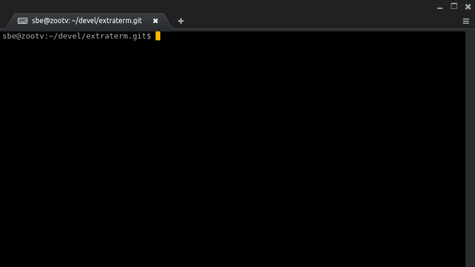
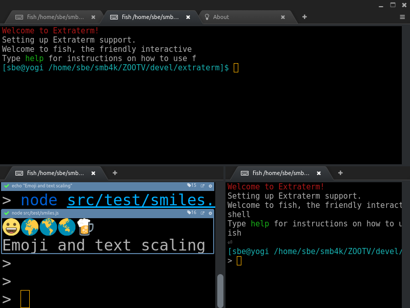

Extraterm
=========
*The swiss army chainsaw of terminal emulators...*

* *Capture and reuse command output as new command input*
* *Manipulate and copy text without leaving the keyboard*
* *Slice and dice command output like a text editor*
* *Display images directly*
* *See the [Visual Tour](docs/tour.md) for more*

### :star: **See the [Visual Tour and Screenshots](docs/tour.md)**
### :star: **[Download and try it out on Linux, Windows+Cygwin and macOS](https://github.com/sedwards2009/extraterm/releases)**
:loudspeaker: :bird: Follow development on [Twitter @ ExtratermDev](https://twitter.com/ExtratermDev)

About
-----
Extraterm is an open source project to build a modern terminal emulator with radical new features to make it more than just a dumb viewer for text output. The aim is to drag the terminal emulator kicking and screaming out of the 80s and into modern computing. More background information is in the [Why document](docs/why.md).

The primary developer is [Simon Edwards](mailto:simon@simonzone.com).

Current features:

* Supports Linux, macOS and Cygwin on Windows
* xterm compatible
* Multiple tabs and panes, split and tiled any way you like
* Keyboard based selection
* Show images in the terminal
* Shell integration; can isolate and 'frame' command output. (bash, zsh and fish supported)
* Previous command output can be used as input for new commands
* Command output is editable in place. Multi-cursor editing
* Keyboard friendly "command palette" for searching menus
* Text zoom
* Unicode support
* Color emoji
* [MIT license](LICENSE.txt)
* [...much more to come](https://github.com/sedwards2009/extraterm/issues/30)

:warning: Extraterm is in development and roughly 'beta' in quality. It is generally stable, but don't be too surprised if you encounter a few bugs. Use at your own risk. :warning:

With that out of the way, the primary author does use it as their main terminal emulator on a daily basis. The basics are in place and it will run most common terminal applications such as vi, emacs and joe without problems and even more demanding applications such as midnight commander.

Further Information
-------------------
* [Getting Started Tutorial](docs/guide.md)
* [Downloads and Releases](https://github.com/sedwards2009/extraterm/releases) (Linux, Windows and OS X supported)
* [FAQ](docs/faq.md)
* [How to Create Themes](docs/theming.md)
* [Development and Contributing](docs/development.md)
* [Current Development Roadmap](https://github.com/sedwards2009/extraterm/issues/30)
* :octocat: Github: https://github.com/sedwards2009/extraterm
