## Guide

- [Getting Started](#getting-started)
  - [Installation](#installation)
- [Basics](#basics)
- [Shell Integration](#shell-integration)
  - [The 'show' Command](#the-show-command)
  - [The 'from' Command](#the-from-command)
- [Splits and Panes](#splits-and-panes)
  - [Drag and Drop](#drag-and-drop)
- [Viewing content with the Show Command](#viewing-content-with-the-show-command)
  - [Frames viewing Text](#frames-viewing-text)
- [Settings](#settings)
  - [General Settings](#general-settings)
    - [Mouse Button Actions](#mouse-button-actions)
  - [Appearance](#appearance)
    - [Terminal](#terminal)
    - [Interface](#interface)
  - [Session Types](#session-types)
    - [Tab Title](#tab-title)
  - [Keybindings](#keybindings)
  - [Frames](#frames)
  - [Extensions](#extensions)
  - [About](#about)
  - [Autocomplete](#autocomplete)
  - [Autolink](#autolink)
  - [Colorizer](#colorizer)
  - [Copy Block](#copy-block)
  - [Copy Link](#copy-link)
  - [Directory Commands](#directory-commands)
  - [Find](#find)
  - [Image Block](#image-block)
  - [Insert Emoji](#insert-emoji)
  - [Open Link](#open-link)
  - [TLDR Pages](#tldr-pages)
  - [Terminal Title](#terminal-title)
  - [Tips](#tips)
  - [Update Checker](#update-checker)
- [Tips](#tips-1)
  - [Keyboard Shortcuts](#keyboard-shortcuts)
  - [Mouse selections when an app grabs the mouse](#mouse-selections-when-an-app-grabs-the-mouse)
  - [Changing where the configuration settings are stored](#changing-where-the-configuration-settings-are-stored)


Note: Keyboard shortcuts given in the documentation apply to the default Windows/Linux shortcuts.


# Getting Started

## Installation

Extraterm supports Linux, macOS, and Windows. The [download page](download.md) describes the different installation methods.


-----------

# Basics

When Extraterm starts it opens one tab and runs your default shell session inside it. If you have used any other terminal before, then this basic functionality will be familiar.

New terminal sessions can be opened using the window or "hamburger" menu in the top right on the window. It also provides access to the Settings.


Sessions open up in different tabs. A tab can be closed using the little cross button on the right side of the tab. The shortcut `Ctrl+Shift+Q` will close a tab immediately.

Use the `Ctrl+,` and `Ctrl+.` shortcuts to navigate left and right between tabs.

Selections can be made with the mouse and are automatically copied to the system clipboard. `Ctrl+Shift+C` will also copy a selection. `Ctrl+Shift+V`, `Ctrl+Insert` or the middle mouse button pastes the contents of the clipboard into the terminal.

The scrollbar on the right or `Shift+PageUp` and `Shift+PageDown` let you scroll through previous output.

The right mouse button on different elements in the window opens the corresponding context menu. Each tab also has options for customizing it in its context menu. Terminal contents also have different options in the context menu.

Files and directories can be dragged and dropped onto Extraterm terminals. The path of the dropped file or directory will be typed into the terminal.

All of Extraterm's features and commands can be accessed via the Command Palette.

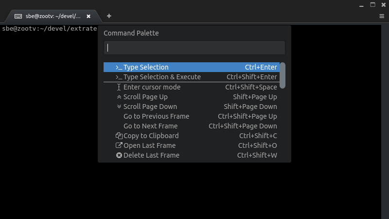

The Command Palette is a pop up menu of commands which can be easily searched for and selected via the keyboard. It grants direct access to all of Extraterm's commands and actions. Open it using `Ctrl+Shift+P`. Commands which are specific to the current context appear at the top of the menu. Cursor up/down and the PageUp/PageDown keys move the selection. The `Enter` key executes the selected command, while the Escape key closes the palette. The items in the menu can be filtered by entering search text.

-----------

# Shell Integration

Extraterm becomes a lot more useful once the shell integration has been set up. Currently the three major shells, bash, zshell and fish are supported.

Go to the [github releases page](https://github.com/sedwards2009/extraterm/releases) and download the `extraterms-commands` zip file. Unzip this file somewhere. Inside are a number of scripts called `setup_extraterm...`. Use your shell's source command to read the script which matches your shell.

Read the script matches your shell using the `.` (source) built in command. For example: bash shell would use `. setup_extraterm_bash.sh` to read the script. The other shells use the same syntax.

Ideally you would read the `setup_extraterm...` script as part of your login scripts.

The shell integration does a couple of things:

* hooks into your shell to report commands invocations to Extraterm.
* hooks into your shell to report the result of command invocations.
* puts two useful commands in your path: `show` and `from`.

When you run a command in your shell, Extraterm can now place a 'frame' around the output of the command. This frame is decorated with the name of the command, an indication of whether it returned a successful zero return code, and also some other controls.

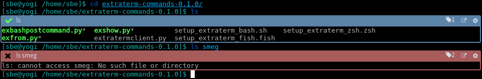

Successful commands are shown with a green check mark on a blue background. Failed commands are shown with a red background to get your attention.

When scrolling back through long stretches of command output, the frame's title bar will remain visible so that you know what you are looking at.

The cross icon in the frame title simply deletes the command output. The 'pop out' icon moves the output into its own tab for safe keeping.

The framing behaviour can be configured in the Setting tab, accessible from the drop down menu located at the 'burger' menu in the top right corner of the main window. By default a number of common unix commands which don't produce output are configured to not be framed.

In the future more shortcuts and features will be added to make more use of this framing and shell integration.


## The 'show' Command

The shell integration adds a pair of new Extraterm specific commands to your shell. The `show` command is a general tool for showing the contents of a file inside the terminal. Currently it supports showing and highlighting many programming languages and mark up languages. It can also show the most common image formats directly in the terminal.

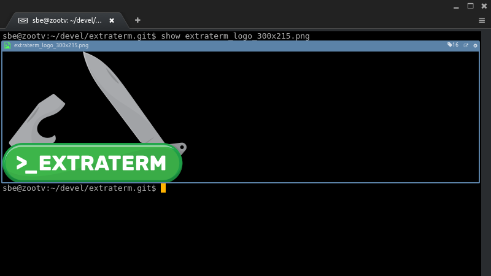

'show' accepts filenames as arguments and will download an show them. It is also possible to pipe data directly into 'show' via stdin.

'show' supports a number of command line options. These options are related to specifying what kind of data is being shown. Most of the time 'show' can figure this out for itself but when piping data directly into 'show' it is sometimes useful to set them.

* **--charset <*charset*>** the character set used by the file. This is only relevant for text files.
* **--mimetype <*mimetype*>** the mimetype of the file
* **--filename <*filename*>** the file name to associate with the file
* **-t, --text** treat the file as plain text. Convenient alternative to `--mimetype text/plain`

Other options:

* **-d, --download** specify this option to show the file as a download and not in a specific viewer


## The 'from' Command

The `from` command is lets you use previous command output as input to a new command. Each command frame has a little tag icon in the title bar with a number. By running the `from` command with the number of the frame you want as its argument you can get the contents of that frame.

For example:

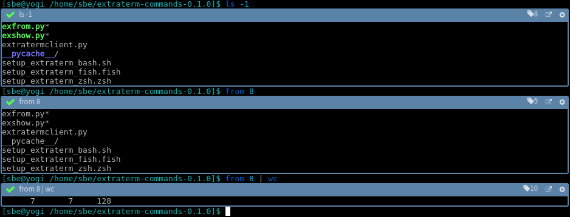

This example is somewhat artificial but it does show the basic use of `from`.

The `from` command isn't limited to read command output from the same terminal session or tab. It can read from any other tab. The command output doesn't have to be from a command on the same machine. It could be from a command on the other side of a ssh session.

The `from` command becomes a lot more useful when you first edit the content of a frame in place to isolate the text you want. The content of frames can be edited when in the selection mode.

For example, I've run `git status` and have a couple of changes. I want to know how many words long the documents I have been working on are, but I'm not interested in the .ts ones. This is the situation after `git status`:

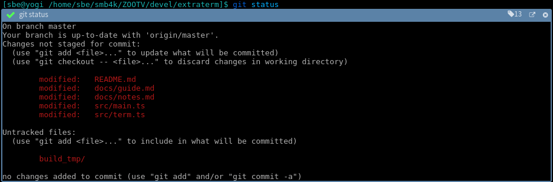

Now I can go into selection mode and cut away the parts of the text I don't need and pull it into my pipe line.


With a shell pipe and `xargs` I can give the list of documents to the `wc` (word count) command:

Using the `--save` or `-s` option `from` can directly write the frame contents to disk using the file's original filename.

-----------

# Splits and Panes

Each terminal is contained in its own tab. Tabs can be arranged, 'split', horizontally or vertically using the `Horizontal Split` and `Vertical Split` commands in the [Command Palette](#command-palette). When a tab is split, it is moved to the side and the Pane Menu appears in the remaining space or 'pane'. The menu allows you to create a new terminal, more splits or to close the pane.

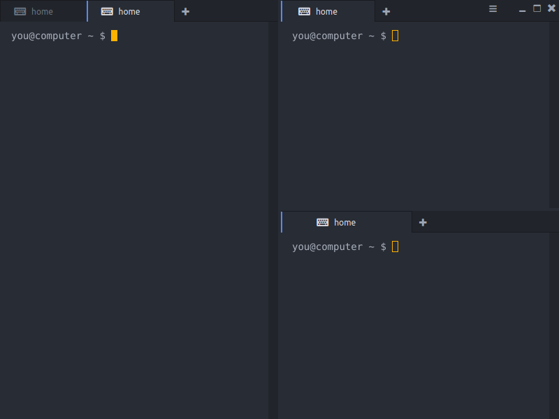

Tabs can be dragged in and out of windows into their own independent windows. They can also be dragged to split and tile them.

## Drag and Drop

Extraterm supports mouse based gestures for rearranging tabs in the tab bar, moving them between groups of tabs, and splitting tabs to create extra panes.

* Tabs can be moved between groups of tabs by dragging them from one group to the other.
* Frames can be dragged by their title bars up into a group of tabs to move them out of their terminal and into their own tab.
* The main content area of every tab can be split different ways depending on where a tab or frame is dropped. Drops towards the top or bottom will split it horizontally, while drops to the far left or right will split it vertically. A drop in the center of the content will simply move the tab or frame up into the tab group.
* Frames can also be dragged right out of Extraterm and dropped on other applications which will accept text.

-----------

# Viewing content with the Show Command

TODO

## Frames viewing Text


# Settings

The Settings tab is accessible via the "hamburger" menu in the top right corner of the window.


## General Settings

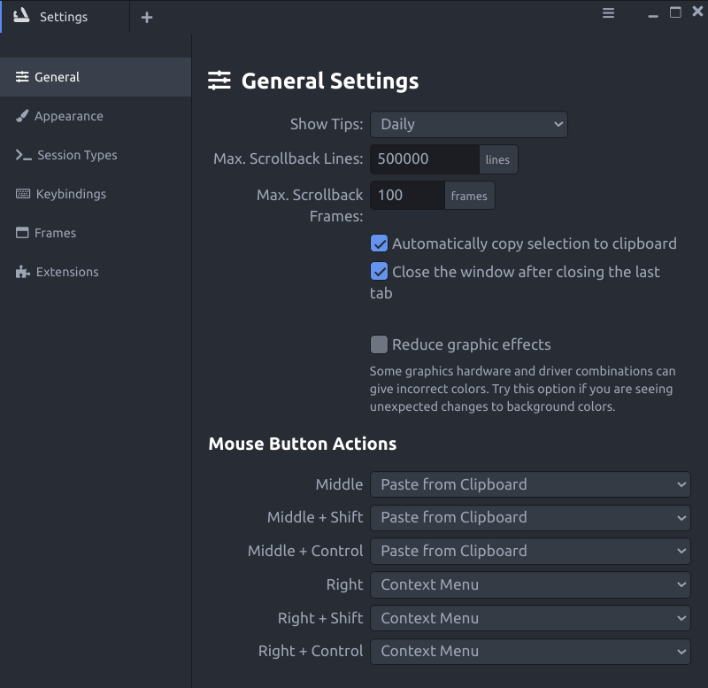

* **Max. Scrollback Lines** - Sets the maximum number of lines the scrollback area (the lines of text which have moved up out of the window) can be before rows are deleted.
* **Max. Scrollback Frames** - Sets the maximum number of frames permitted in the scrollback area before they are deleted.
* **Automatically copy selection to clipboard** - If this is on, then any selection is automatically copied to the system clipboard.
* **Close the window after closing the last tab** - If this is on, then the window will automatically close once the last tab has been closed. Otherwise the window will remain open.

### Mouse Button Actions

The actions attached to the middle and right mouse buttons can be set here. Combinations of modifier keys and mouse buttons are supported. The different available actions which can be set are:

* **None** - No action.
* **Context Menu** - Show the context menu.
* **Paste from Clipboard** - Paste the contents of the clipboard into the terminal.
* **Paste from Selection Clipboard** - (Linux only) Paste the contents of the special selection clipboard into the terminal.


## Appearance

The Appearance tab is grouped into a few sections.

### Terminal

Settings related to how terminal tabs and their contents appear.


* **Font** - The font to use for text inside a terminal. The default is "Liga DejaVu Sans Mono" which ships as part of Extraterm itself. This mono-space font has wide Unicode coverage and support for technical ligatures.
* **Font Size** - The font size to use for text inside a terminal.
* **Enable ligatures** - If your terminal font support ligatures and this is enabled, then ligatures will be applied to text inside the terminal. See "What are ligatures?" below.
* **Theme** - The color theme for terminals can be selected here. The button "User themes" opens the directory in the system file manger where your own theme files can be placed. The reload button rescans this directory. The list of different theme file formats is shown below the buttons.
* **Cursor Style** - Sets the cursor style to use inside terminals. Options are *block*, *lower bar*, and *vertical bar*.
* **Margin** - Sets the size of the margin surrounding the terminal text and edge of the tab containing it. Options are *None*, *Thin*, *Normal*, and *Thick*.
* **Preview** - The colored text below the options show a preview of the selected theme, font, cursor and ligature settings.

💡 *What are ligatures?*

Ligatures are visual replacements for groups of characters (actually called "glyphs") when displaying text. In traditional typesetting, groups of characters like "fi" may be replaced with a different image which combines the two in a more visually pleasant way. In the context of computer text editors and mono-space terminals, the idea of ligatures is being used to create better looking images for common groups of symbols. For example, it is common to use a dash and greater than sign, "->" to represent an arrow. A ligature for this combination will show a real arrow instead.

### Interface

Settings related to the general appearance of the whole application.

* **Zoom** - Increases or decreases the size of all elements and text in the user interface of the whole application.
* **Window Title Bar** - Sets type of title bar for the Extraterm window. *Native* is just the normal operating system title bar. *Theme* is a themed title bar. *Theme Compact* is also themed but is more compact and doesn't show the window title.
* **Show icon in system tray** - If this is on, then Extraterm icon will appear in the desktop tray.
* **Minimize window to tray** - If this is on, then the Extraterm window will disappear from your desktop taskbar when it is minimized. The window can be shown again by using the icon in the system tray.

## Session Types

Extraterm supports different terminal session types. The most common type for Linux and macOS systems is just the user's default shell. Windows has different types like CMD, PowerShell, WSL, and WSL2. By default the most common session types are available, but it is also possible to modify them, add new ones, and remove unwanted ones.

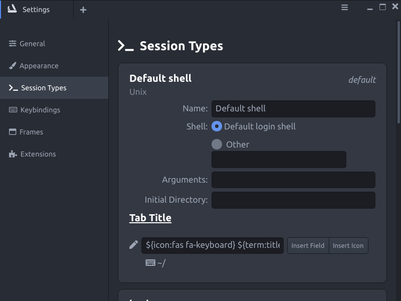

The session at the top of the list is used as the default session type when Extraterm starts up, or when the plus button in the tab bar is used. A session type can be promoted to default by clicking the double up arrows in the top right corner of the card.

New session types can be added using the buttons at the bottom of the tab. Session types can be deleted using the cross in the top right corner of the session type card.

Each session type will typically have the following settings:

* **Name** - A readable name for the session type.
* **Shell** - The shell command to run when an instance of this session type is created. This can be the user's default shell or the path to a shell command can be entered.
* **Arguments** - Arguments to the shell command.
* **Initial Directory** - The directory in which the shell command should be started. If this is left blank then Extraterm will try to use the same directory as the current terminal when the new terminal command is executed.

Extensions can add additional settings below the primary session settings.

### Tab Title

Settings for the session's default tab title appear at the bottom of each card. It defines the title to use on tabs for terminals using this session. The text box holds the pattern to use to build up the title. This can be just text or a number of special codes which are later substituted. The "Insert Field" and "Insert Icon" menus show the available codes. A preview of the tab title appears below the text box.

"Fields" are characteristics of the terminal which can be shown in the title. For example, the size of the terminal in rows and columns, or the exit code of the last command.

Icons are just icons which can be placed anywhere in the title. The format of the codes for icons are just `${icon:name}` where `name` is the Font Awesome HTML name for the icon. Only Free [Font Awesome](https://fontawesome.com/icons) icons are available.


## Keybindings

Keybindings, also known as keyboard shortcuts, connect key combinations to Extraterm commands.

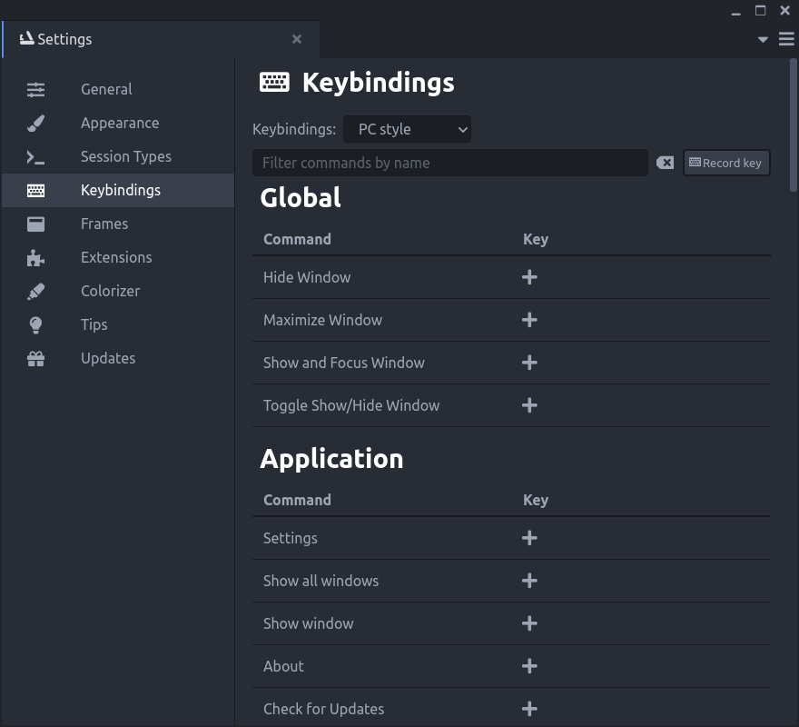

The "Keybindings" dropdown at the top lets you select a base set of keybindings. The list of commands are shown below and grouped into "Global", "Application", "Window", "Text Editor", "Terminal", "Terminal: Cursor Mode", "Hyperlink", and "Viewer Tabs". Different contexts within Extraterm can have different keybindings active.

Keybindings in the "Global" section are active even if the Extraterm window does not have the focus. They can be invoked from any other application.

Moving the mouse pointer over each command shows the buttons to add a new keybinding, delete an existing keybinding, or revert a keybinding back to the default. To add a keybinding, click on the plus button next to the command and then press the key combination.

Commands can have multiple keybindings assigned to them.

At the top of keybindings settings is a text box for filtering and searching the list of commands. It is possible to search by key combination. Click on the "Record key" button and then press the key combination.


## Frames

Frames in Extraterm hold and group the output of commands. The [shell integration](#shell-integration) needs to be setup to enable this feature.

Rules controlling when and how to apply frames to different commands can be changed here.

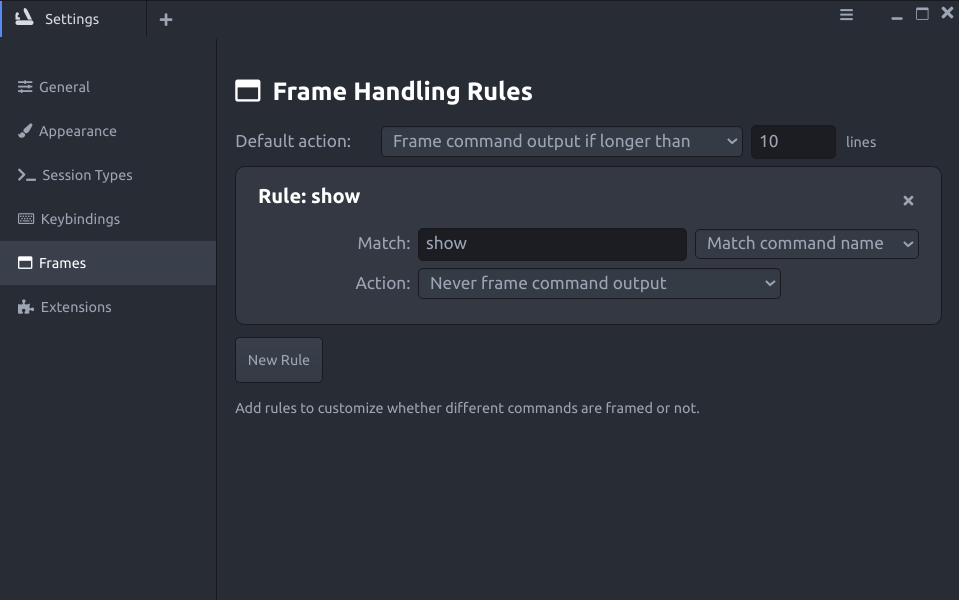


The *Default action* dropdown set the base general rule for when to apply a frame to command output.

* **Always frame command output** - Always frame a command's output.
* **Never frame command output** - Never frame a command's output.
* **Frame command out if longer than** - Only frame a command's output if it is longer than the set number of lines.

Rules can be added to customize how frames are applied to different commands. Each rule card has the folowing settings:

* **Match** - The name of the command or regular expression pattern to use. The dropdown to the right determines how to apply the match. This is either *Match command name* or *Match regular expression*.
* **Action** - Sets the action to take if this rule matches. The same options are available as for the *default action* above.

Rules can be added with the *New Rule* button and deleted using the cross button in the top right corner of the rule card.


## Extensions

Many of the features in Extraterm are done using Extensions. Extensions or plugins, extend the functionality of the base application.

This tab lists all of the extensions, gives information about them and how they integrate with Extraterm, and allows them to be enabled or disabled.

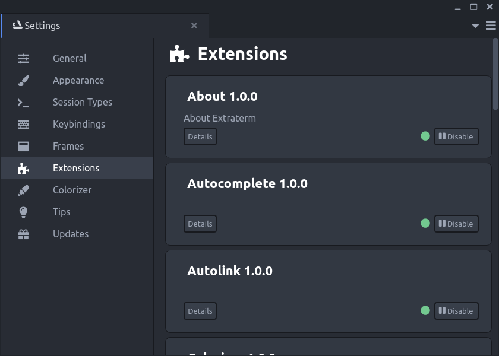

The details button on each extension card gives more information about how the extension integrates with Extraterm and what facilities it adds.

Extensions can be enabled or disabled by the button in the bottom right corner of the extension card.

## About

This extension simply adds the About tab. Yes, the About tab is just an extension.

## Autocomplete

## Autolink

Autolink detects links in the terminal output and turns them into real links which have proper context menus and can be opened using Ctrl+Click.

## Colorizer

Colorizer scans the terminal output for certain patterns and words and colors them. This is useful for highlighting important text in command output such as "error" or "warning".

For example:

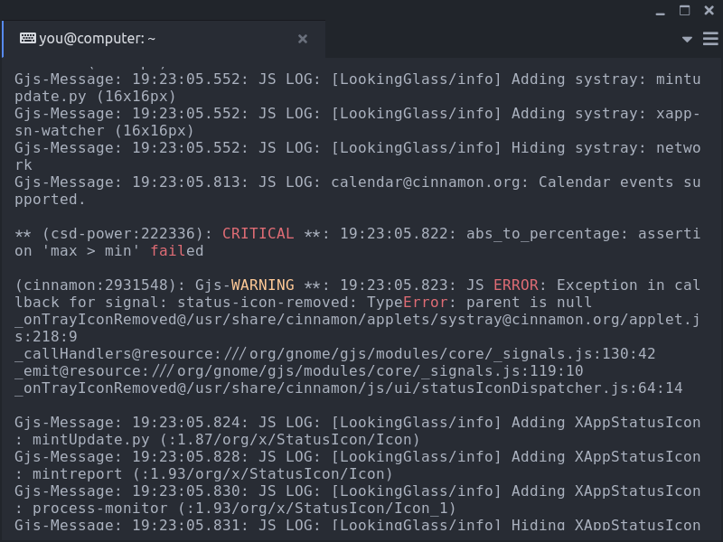

This extension has an area in the Setting tabs where it can be configured. The whole extension can be easily enabled/disabled using the checkbox. Most of the configuration is the list of rules defining text pattersn to match and highligt.

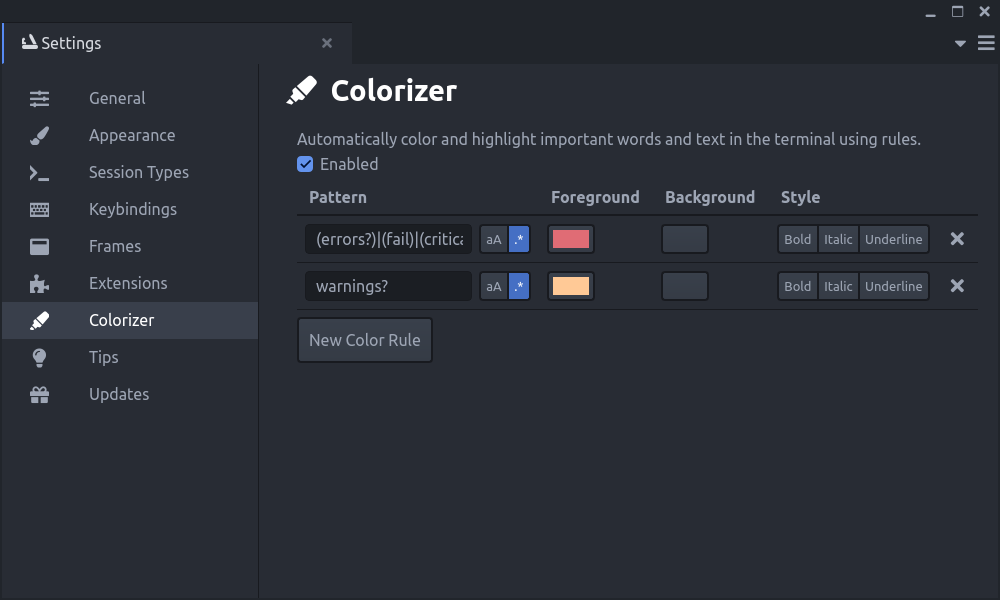


## Copy Block

## Copy Link

## Directory Commands

## Find

## Image Block


## Insert Emoji

The "Insert Emoji" command is available in the Command Palette. It opens a list of emoji from which you can select one to insert into the current terminal.

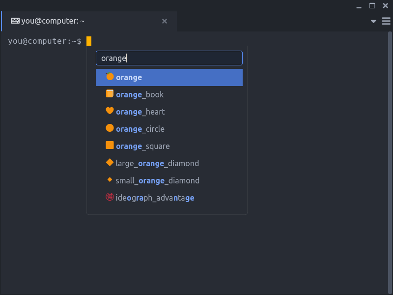

## Open Link

## TLDR Pages

## Terminal Title

## Tips

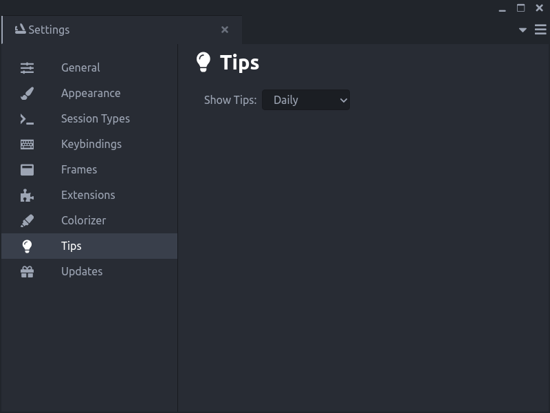

## Update Checker

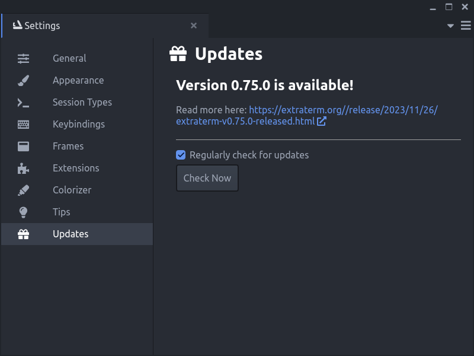

-----------


# Tips

See the [FAQ](faq.md) too

## Keyboard Shortcuts

The list of available keyboard short cuts can be seen on the 'Keybindings' tab which is accessible via the "hamburger
menu" in the top right corner of the window.

Extraterm comes with a number of built in keybindings configurations. These are not directly editable. To customize keyboard shortcuts you must first duplicate one of the default keybindings sets by selecting it and clicking on the Duplicate button  positioned right to the dropdown. Click the Rename button to give this new configuration a suitable name. You can now edit the keybindings for all commands.


## Mouse selections when an app grabs the mouse

Some applications use the mouse input themselves and prevent normal mouse selection from working. In these cases it is possible to hold the Control key and then make a selection with the mouse.


## Changing where the configuration settings are stored

By default Extraterm stores the user configuration in a directory deep in the user's home directory/profile. The location of
this directory can be changed by placing a `application_paths.json` file in the same directory as the Extraterm executable. It is in json format. A simple `application_paths.json` is:

```
{
  "userSettingsPath": "user_settings"
}
```

It contains one setting which specifies which directory to use for user settings. If this is empty or not set, then the default location is used. If this path is relative then it is relative to the directory containing the Extraterm executable.

`../user_settings` can be used to place it along side the location where Extraterm is installed. This can be usefull when running Extraterm as a "portable app" from removable media like a USB drive.
