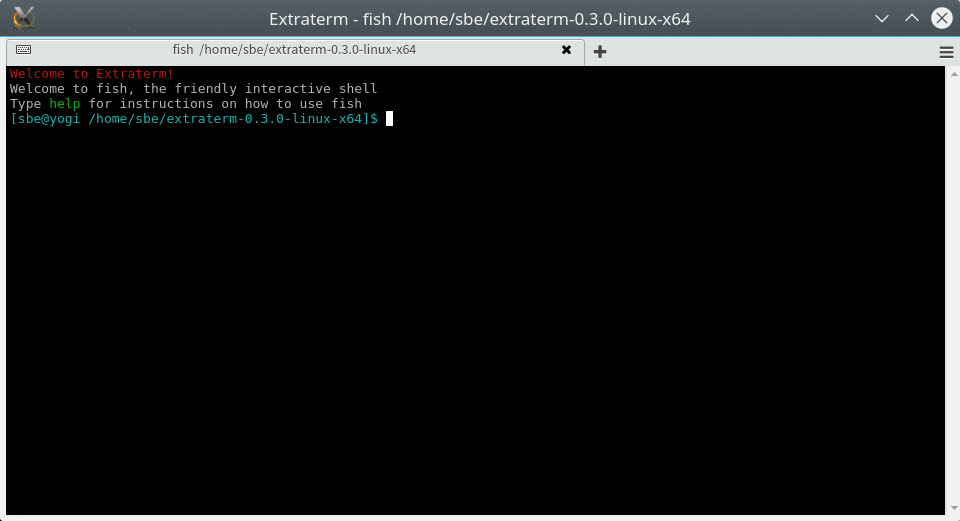
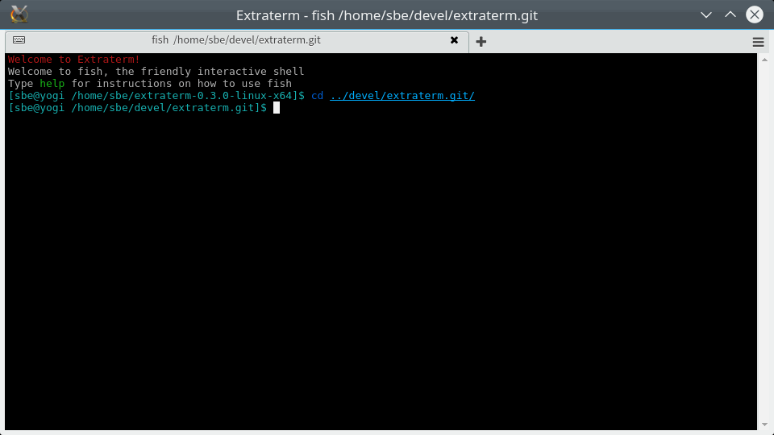

Extraterm Tour
==============

Extraterm is a open source terminal emulator which aims to add many new features to bring the traditional terminal into the modern era.

It is currently in heavy development and not ready for production use, although this has failed to stop the main developer from using it as their main terminal emulator.

Backwards compatibility with the decades of existing terminal based applications and your decades of workflows and habits is very important. Extraterm supports your existing applications and doesn't require you to change your habits.

Use the shell integration to unlock Extraterm’s power. Bash, zshell and fish are currently supported. Quickly move between the output of different commands, put interesting command output to the side in its own tab, or just delete it directly.

Extraterm features a powerful keyboard based selection mode. Copy and paste without having to leave the keyboard.

Extraterm supports directly viewing richer content than just text. Works across ssh too.

Command output can be directly edited in place. The “from” command lets you use previous command output as input for terminal commands. This enables new fast "ad hoc" workflows.
