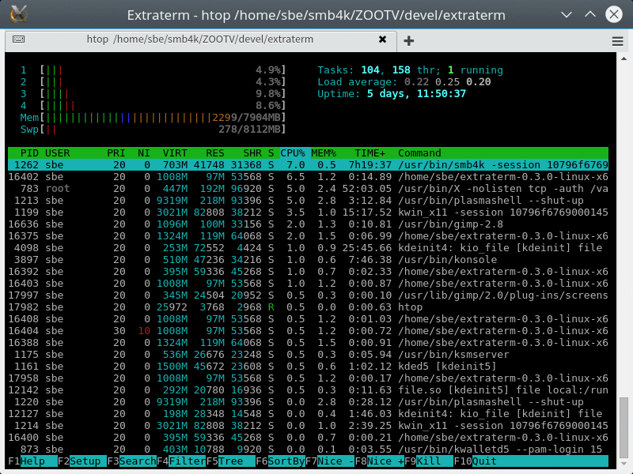
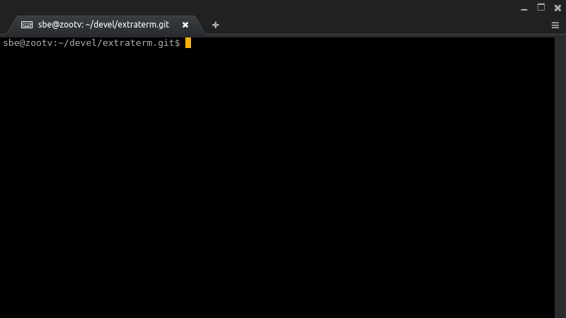
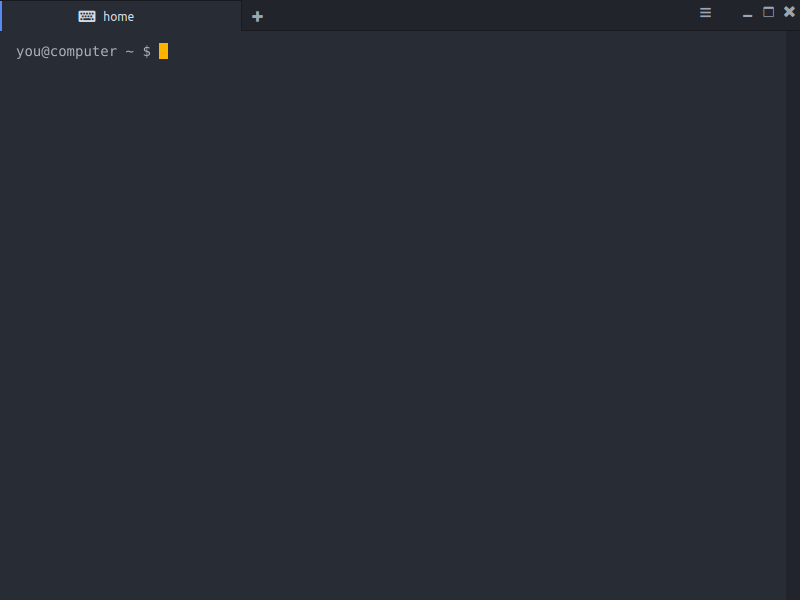

Extraterm is a open source terminal emulator which aims to add many new features to bring the traditional terminal into the modern era.

It is currently in heavy development and not ready for production use, although this has failed to stop the main developer from using it as their main terminal emulator.

Backwards compatibility with the decades of existing terminal based applications and your decades of workflows and habits is very important. Extraterm supports your existing applications and doesn't require you to change your habits.

Use the shell integration to unlock Extraterm’s power. 

Command output is clearly marked and return status of commands is clearly visible. Interesting command output can be put in its own tab, or just delete it directly. Bash, zshell and fish are currently supported. Extraterm features a powerful keyboard based cursor mode. Copy and paste without having to leave the keyboard.

Extraterm supports directly viewing richer content than just text. Works across ssh too.

The “from” command lets you use previous command output as input for terminal commands. This enables new fast "ad hoc" workflows.

Or you can edit the command output directly in place and execute the selection with `Ctrl+Shift+Enter`.

Extraterm also supports tiling and panes, text size scaling per terminal session and color emoji on all operating systems.

Extraterm is designed for keyboard use first. The Command Palette makes it easy to find and execute any command without leaving the keyboard.

